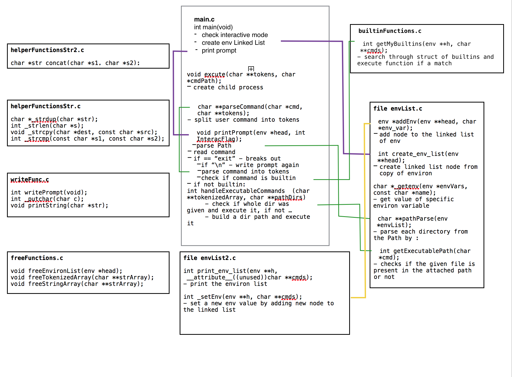

# C Shell

## Description

This project is aimed to replicate many of the function performed by a bash shell. This is created as a part of Holberton School curriculm. The project aims at learning how to build a simple shell ,understanding the concept of pid and ppid, understanding the difference between function and system calls, learning to create process, using the execve command, understanding about environ variables, implementing functions such as getline, strtok and built in functions like cd, setenv, unsetenv etc.

### List of allowed functions and system calls
* access : check user's permissions for a file
* chdir : change working directory
* close : close a file descriptor
* closedir : close a directory
* execve : execute program
* exit : terminate the calling process
* fork : System call fork() is used to create processes
* free : deallocates the memory previously allocated by a call to calloc, malloc, or realloc.
* fstat : get file status
* getcwd : Get the name of the current working directory
* getline : delimited string input
* kill : kills a process
* lstat : get symbolic link status 
* malloc : allocates a heap memory
* open : opens a file
* opendir : opens a directory
* perror : prints a descriptive error message to stderr
* read : read from a file
* readdir : reads from a directory
* signal : signal management
* stat : status of a file
* strtok : tkenizes a string
* wait : waits for a process to end
*  waitpid : waits for process pid to end
* wait3 : wait for process to change state
* wait4 : wait for process to change state
* write : write to stdin strerr or stdout
* _exit : terminate the calling process

### How to compile
C shell will be compiled this way:

`gcc -Wall -Werror -Wextra -pedantic *.c -o hsh`

### Builtin Commands
A built-in command is simply a command that the shell carries out itself, instead of interpreting it as a request to load and run some other program. This has two main effects. First, it's usually faster, because loading and running a program takes time. Of course, the longer the command takes to run, the less significant the load time is compared to the overall run time (because the load time is fairly constant).

Secondly, a built-in command can affect the internal state of the shell. That's why commands like cd must be built-in, because an external program can't change the current directory of the shell. Other commands, like echo, might be built-in for efficiency, but there's no intrinsic reason they can't be external commands.

####cd [directory] ``not yet implimented``
Switch to the specified directory (default HOME).  If an entry for CDPATH appears in the environment of the cd command or the shell variable CDPATH is set and the directory name does not begin with a slash, then the directories listed in CDPATH will be searched for the specified directory.  The format of CDPATH is the same as that of PATH.  If a single dash is specified as the argument, it will be replaced by the value of OLDPWD.

#### env  [-] [NAME=VALUE]... [COMMAND [ARG]...]
Prints out the current environment.

#### exit [exitstatus]
Terminate the shell process.  If exitstatus is given it is used as the exit status of the shell; otherwise the exit status of the preceding command is used.

#### setenv [VARIABLE] [VALUE]
The setenv() built-in adds the variable name to the environment with the value value, if name does not already exist. If name does exist in the environment, then its value is changed to value if overwrite is nonzero; if overwrite is zero, then the value of name is not changed. This function makes copies of the strings pointed to by name and value.

#### unsetenv [VARIABLE] ``not yet implimented``
The unsetenv() built-in deletes the variable name from the environment. If name does not exist in the environment, then the functionsucceeds, and the environment is unchanged.

####alias [name[=string ...]] ``not yet implimented``
If name=string is specified, the shell defines the alias name with value string.  If just name is specified, the value of the alias name is printed.  With no arguments, the alias builtin prints the names and values of all defined aliases (see unalias).

### external functions
This shell will support all functions that can be found within a ``PATH`` environ variable
Examples
ls, cat, time, date, mkdir

### File Descriptions

1. `shell.h` : Header file which contains all libraries, structs and function prototypes

2. `main.c` : The entry point where the command is read, parsed and executed
Below are the functions present:
	* ``excute()`` - executes the parent and child process
	* ``parseCommand()`` - tokenizes the commandline that is read from the terminal
	* ``handleExecutableCommands()`` - checks if the executable path is valid
	* ``printPrompt()`` - prints prompt, gets a line containing command
	* ``main()`` - the main entry point of shell program

3. `helperFunctionsStr.c` : helper functions for string manipulations
	* ``char *str_concat(char *s1, char *s2)`` : concatenates two strings
	* ``int _strlen(char *s)`` : returns the length of a string
	* ``char *_strdup(char *str)`` : returns a pointer to a newly allocated space with copy of arg
	* ``void _strcpy(char *dest,const char *src)`` : copies a string
	* ``int _strcmp(const char *s1,const char *s2)`` : compares two strings
3. `envList.c` : contain functions related to environ variables and its manipulations 
	* ``_getEnv()`` : gets the value of a specific environ variable
	* ``createEnvList()`` : creates a list of environ variables
	* ``addEnvNode()`` : adds an environ variable to the environ list
	* ``char **pathParse(env *envList)`` : parses each directory from the PATH dir string
	* ``getExecutablePath()`` - checks if the given file is present

4. `envList2.c` : contain builtin function related to environ variables
	* ``print_env_list()`` : prints the environ list
	* ``setEnv()`` : function to set a new env value
	* ``_setEnv()`` - function to set a new env value

5. `freeFunctions.c` : functions for freeing memory
	* ``void freeEnvironList(env *envList)`` :  frees the list
	* ``void freeStringArray(char **strArray)`` : function to free tokenized array
	* ``void freeTokenizedArray(char **strArray)`` : function to free array of strings

6. `writeFunc.c` : functions frelated to stdoutput 
	* ``int writePrompt(void)`` : function that writes to stdoutput
	* ``int _putchar(char c)`` : writes the character to stdout
	* ``void printString(char *str)`` : prints a string

7. `builtinFunctions.c` : has function ``int getMyBuiltins(env **h, char **cmds)`` that checks if the input command is a builtin command or not and points to the corresponding builtin command function if it matches the string in the builtin struct.
### Team Members

Halina Veratsennik: [github account](https://github.com/halinav00), [twitter](https://twitter.com/HalinaV)

Megha Mohan: [github account](https://github.com/meghamohan), [twitter](https://twitter.com/meghamohan1989)
